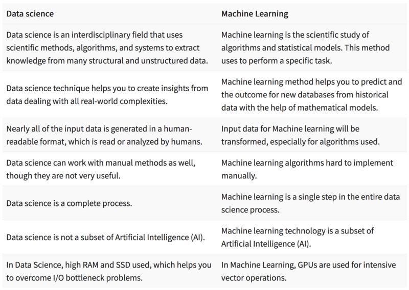

#  Notes on Machine-Learning, Artificial Intelegence and Data Science 

Notes on Machine-Learning, Artificial Intelegence and Data Science

(as well as Data-science)

## **Some important topics/challenges/techniques/modification on ML and AI systems are suggested/described in bellow.**

## 1. Data Science vs. Machine Learning 

> Comparison between ML and DS [1](Fig1)
[1](https://www.guru99.com)
Fig1 

 
