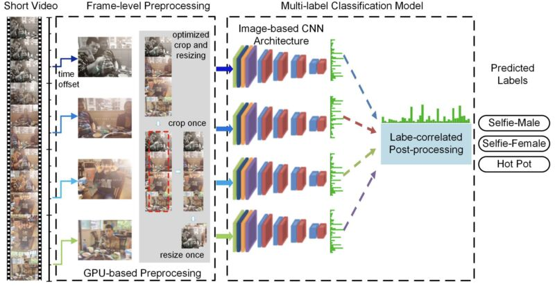

# Notes on Machine-Learning (ML), Artificial Intelegence (AI)

## *Some important topics, challenges, techniques, improvemnents on ML and AI systems and therei correlations with data science are represented in bellow.*

-----

## 1. Data Science vs. Machine Learning 

 
www.guru99.com

----
## 2. DS/ML are multi-disciplinary

www.quora.com

----
## 3. Studying data before applying a model:
It always worths to know about the data to apply ML as an insightful tool. Apply graphical and non-graphical techniques (exploratory data analysis or EDA) to observe data carefully before applying ML. Common mistakes can be due to unbalanced data, sampling bias, data errors, outlier data, gamed data, data duplicates and so on.

Be careful about Data Leakage ignorance (e.g. a part of information is not considered during training). Split the data before analysis, identify leaky features, use only information from the past for prediction, be suspicious to leakage when results are extremely good.

----
## 4. Overfitting the model

Make sure you are avoiding overfitting by development in your Test-Set. For an appropriate ML usage, you must have enough data for multiple tests and to apply blind sets for later-on evaluation. Never use test sets for several times which may tend to overfitting. Try to apply the newest hyper-parameter optimization techniques.

----
## 5. 
Pay attention to the Model you are using, e.g. carefully observe weights for regression analysis, splits for decision tree, feature visualization, activation atlas and grand tour for neural networks. Could be insightful if you apply appropriate visualization techniques on your data. Also apply diverse AI tools. Evaluate your model for different metrics and unusual inputs and carefully interrogate outputs.

----
## 6. Start with simple models
Avoid to start with a complex machine learning models and try simple baseline models first. To improve your model to a more complex one, examine the contribution and necessity of each part of the complex model and exclude the redundant parts.

stats.stackexchange.com

----
## 7.
Be careful about the case study you are applying ML on. Before applying ML techniques makes sure if this is an appropriate tool by estimating cost, benefits, min viability of product, project risk, data privacy/bias/transparency and accuracy of AI and ML infused applications. In some case ML may only help to categorize across possible options but may need to be interpreted along with other perspectives and background info to be insightful.

coforge.com

----
## 8. Validation of the model
Always perform a failure analysis and validate your model, specifically for frequent problems addressing the most frequent ones first and estimate the improvement level. Using this step try to efficiently modify your model such a way that level of effort is minimized. 

oreilly.com

To evaluate how well a certain machine learning algorithm models the input data, diverse loss functions are used. Selecting the type of the loss function is crucial and can be generally classified into two major groups
- Regression losses: Mean Square Error (Quadratic Loss), Mean Absolute/Bias Error, ...
- Classification losses: Hinge Loss(Multi class SVM Loss), Binary/Categorical Cross Entropy Loss, ...,
depending upon the chosen ML algorithm, size of outlier data and level of calculation and so on. 

----
## 9. Data cleaning
Depending on the case study and its context, it might be important to take care of outliers. For instance in Cancer Study some rare sub-population of cells (outliers) can be responsible for triggering cancer. The type of the ML modeling algorithm you in use can be more or less sensitive to outliers and thus can boost or ignore the importance of outliers. For example, AdaBoost assigns large weights to outliers while decision tree method considers outliers as false classifications. 

Data-cleaning is an important step of data preparation for machine learning, artificial intelligence and data science. Noisy data would cover the real features and make it harder to make machine learning associated decisions, their accuracy, efficiency and consistency. Cleaning the data provides more accurate predictions.

Some techniques for cleaning datasets are:
- Remove unnecessary/duplicate values
- Unify data types
- Avoid probable typos
- Take care of missing values
- Impute missing values
- Flag missing values

#sparsity is due to the majority of zero values associated to features
(almost all elements are zeros). Sparse data sets cause #overfitting and sub-optimal results in #machinelearning models. Moreover, sparsity can increase time complexity of data operations. To solve this problem in machine learning, one may try different representation of sparse data using alternative data structures such a way that only non-zero values be stored for later-on action.

To this end, some techniques for reducing the effect of sparse data are:
- compressing sparse row (CSR): efficient access supproting matrix multiplication
- compressed sparse column (CSC)
- using dictionary of keys; mapping row/column indexes to values
- using list of lists: rows are stored in a list with sub-lists of column indexes and array values
- using coordinate List: list of tuples containing row and column indexes as well as the array values

Other than #sparsity issue in #machinelearning (#ml) in real-world applications, datasets often include #missingdata. For instance, deep-sequencing technologies are not perfect enough to profile all genetic transcription data which generates missing data. Many ML systems are not designed to support missing values and therefore, we need to handle this issue at data-preparation level.

Some approaches to handle missing data are:

- #deletion: the simplest way of handling missing data but can increase #bias in #trainingdata. Two types of deletion are
1. #listwise (complete-case) analysis: removes all data for a case that has one or more missing values.
2. #pairwise deletion (available-case analysis): excludes values only when there is a certain data point needed to test if the value assumed to be missing, is actually missing. Thus it can be a source for non-positive definite matrices in multivariate analyses.

- #imputation: replaces missing data by predicted values (non-missing data is usually used for this purpose). Some imputation other those approaches are:
1. Simple imputation (missing data is calculated by different tools: mode, mean, median of the non-missing data)
2. Regression imputation
3. Hot-deck imputation (matching with non-missing values and key variables of non-missing values)
4. Expectation–maximization (impute, estimate & iterate until
convergence)
5. Multiple imputation (results of first imputed data sets are combined for the final imputation result)
6. Imputation methods inspired by machine learning: KNN, SVM, Decision tree, Clustering, ....

Another concern within data-preparation in #machinelearning (#ml) and #datascience (#ds) is due to #outliers. Outliers can be considered as those data points that are very different than the rest of data. To have a better training in a ML system and to reduce #bias in training data, outliers are usually excluded. Not all outliers are supposed to be removed as they may contain worthwhile information to be kept and introduce a new angle to be considered later on.

For instance data points way different than other values may drastically affect the result of #featurescaling or #linearregression which are applied on all observations. However, it may not influence #decisiontree which is independently associated with each observation.

Depending on the context of the problem as well as the model being applied, outlier-removal (also called #anomalydetection) process can be perform differently. Simple methods remove outliers using standard deviation, interquartile, MAD or so to eliminate rows of outliers containing outliers. More advance techniques impute/replace outliers to delineate their impact.

Within data preparation stage for #machinelearning (#ml), not only we take care of #sparsity, #missingvalues or #outliers, but we may need to be careful about
- #lowvariance data(redundant samples) and
- #duplicates (redundant features)
within the data set. Except needed, these subset of data should be filtered out during #datacleaning (#datacleansing).

Low-variation occurs when a column of data contains only a few unique values. Such column will not add any benefits to the #learningprocess, and require more time and #storagespace during #training; thus, can be eliminated.

Duplicates usually occur within rows of the data which have no learning benefits but require extra storage space and tend to #precessing #overhead. Duplicates are supposed to eliminated before training the ML model.

----
## 10. Support vector machine (SVM)
SVM -as one of the most powerful modeling algorithm in machine learning- is usually used to fit the model with diverse kernels and provide a richer feature space. However, one should be careful while using SVM models for the case in which

(number of samples) << (number of features).

For instance in medical data (e.g. genomics or other omics data), there will be a high risk of overfitting the data. In such cases we should improve data by decreasing the number of features, increasing regularization, changing the model architecture and so on. 

learnopencv.com

----
## 11. Web services for ML models
Among a varity of existing cloud computing platforms (web services) to perform #machinelearning and #artificialintelligence algorithms; the most popular ones are:
- Amazon Web Services,
- Microsoft Azure,
- Google Cloud, and
- IBM Cloud.

dailyhostnews.com

----
## 12. Big data
The field #bigdata study is a field of efficiently dealing with a large amount of data (may grow over time) that cannot be processed via traditional #dataprocessing techniques/softwares. Note that the higher observation in data, the more #accuracy and false discovery rate (#fdr) can be acheived using big data sets. #bigdata is at the intersection of #machinelearning, #artificialintelligence and #datascience and plays a crucial role. some associations between #bigdata and #machinelearning are presented in the enclosed fig. 

techtarget.com

----
## 13. Defining a ML model
How to define a model for ML. A #machinelearning model comprises of mathematical configuration based on observed data so be able to predict new data at certain accuracy level (been previously estimated). Here are the steps towards generating a model in #machinelearning:

- Data exploration and QC
- Pre-processing the data
- Assign #training and test subsets of the data
- Provide a #classification model
- Generate a #pipeline of all the above steps
- Train the model using training data
- Run #predictions
- Validate #performance of the model

developer.ibm.com, integritytrade.tk

Working with a #machinelearning model, the best learning experiment can occur using real-world data. Depending on the context of the study, some open-source datasets/repositories are listed in below:

1. Popular repositories:
- Kaggale (huge data for experts)
- UCI Machine Learning Repository (up to date resource for open-
source datasets)
- Amazon's AWS datasets (a vast amount of data publicly available
through AWS services)
- VisualData (categorical computer vision datasets)
- CMU Libraries (high-quality datasets)
- Awesome Public Datasets on Github
- The Big Bad NLP Database (provided by Quantum Stat)
- IBM Data Asset eXchange (DAX) (a repository of free and open
datasets for machine learning)
- Google Dataset Search (similar to Google Scholar usage)

2. Meta data portals:
- Data Portals (meta-database with 524 data portals)
- OpenDataSoft (with more than 2600 data portals)
- Re3data (with 2000 research data repositories)
- Knoema (~3.2-billion time series data of 1040 topics from more
than 1200 sources)
- Open Data Monitor
- Quandl

3. Other pages containing open-source data repositories:
- Wikipedia's categorical list of Machine Learning datasets
- Quora.com
- The datasets subreddit
- Eurostat (from the EU statistical office)
- Data.gov (261,073 sets of the US open government data)

One important step towards applying #machinelearning (#ml) system is transfering data. This is usually done through automated ML pipelines. Such pipelines suggest efficient techniques to automatically transform (or diverse transform) datasets. #sklearn and #sklearn #pandas are some well-known libraries for implementation and/or performing ML pilelines.

----
## 14. ML system's performance
To examine machine learning model’s performance, we may validate the model based on its prediction as well as generalization on an independent test data. More precisely, the goal in ML model is to minimize the #error of #testdata. Error on the test data which is the sum of norm on actual output and predicted output.

Error = reducible error (i.e. bias^2+variance) + irreducible error (from unknown variables affecting the output variables)

Irreducible generalization error in #machinelearning comprises of two important factors:
1) bias - is because of wrong assumptions (e.g. linear while is quadratic) and due to far differences between predicted and actual data. High bias is most likely associated with #underfitting the  training data.
2) variance - is, however, correlated to high sensitivity of the ML model to small changes in the  training data. More precisely, when the model is well stablished on trained data while but not on test/validation datasets. Variance represents the level of dispersion on predicted from actual values in a dataset. High variance associates with overfitting and modeling random noise in the training data.

statlearning.com

----
## 15. Principal component analysis (PCA)
One of the most important steps in #unsupervised #machinelearning algorithms is principal component analysis #pca. Usually pca is used for:
- reducing dimensions in #trainingdata
- #visualization of high-dimensional data
- de-noising data sets
- data compression unifying similar features
- data clarification of convoluted data, ...

#pca usually takes the following steps:
- normalizing the data distribution using z-score (to have mean equal to 0 and variance to 1)
- simply using the matrix of features or computation of the covariance/correlation matrix of features
- finding the eigenvectors and eigenvalues from the latter matrix to identify principal components
- Decreasingly sorting the eigenvectors via based on their eigenvalues and select the most n significant ones (feature vectors)
- Projecting original data to the feature vector coordinates

towardsdatascience.com

Working with high-dimensional (multivariate) data tends to overfit in #machinelearning #ml models and thus dimensionality reduction approaches are implemented to modify data prior to modelling.
Principal component analysis #pca is one of the popular dimensionality reduction techniques which is an unsupervised learning method that clusters data based on a set of orthogonal components that suggest maximum variances across all other components.

some specific types of PCA are:
- Sparse PCA (limiting input variables applying sparsity constraints)
- Nonlinear PCA (nonlinear dimensionality reduction using principal curves instead of linear PCA) 
- Robust PCA (weighted PCA that increases robustness by decreasing the effect of outliers)
- Incremental PCA
- Kernel Principal Component Analysis (kPCA, applying kernel methods)
- Non-negative matrix factorization (NMF 0r NNMF which decomposes data into factorize it into two matrices of non-negative elements)

----
## 16. Ensemble learning
#ensemble learning is a #supervisedlearning technique which combines/optimizes and #trains multiple (weaker) learning methods to solve more complex problems at higher #accuracy level for the purpose of #prediction and/or #classification and to improve the generalization errors.

#metalearning usually is referred to an #ensemble learning algorithm that can combine the predictions of other #machinelearning algorithms and thus learn from those learning algorithms. Meta-learning is sometimes associated with multiple inter-connected prediction models in which the algorithm learns how to learn (namely #multitasklearning). In a meta-learning system, algorithm, classifier, regression and model are resp. called #metaalgorithm (learner), #metaclassifier, #metaregression and #metamodel.

Some of the meta-algorithms used in ensemble methods are:
- #bagging (Bootstrap Aggregation): learns homogeneous weak learners independently and combines the results as a deterministic average. Bagging is usually used to reduce #overfitting and #variance problems.
- #boosting: learns homogeneous weak learners sequentially and combines the results through diverse deterministic strategies. This weighted average meta-learning approach is used for reducing #bias and variance.
- #stacking (stacked generalization): learns heterogeneous weak learners independently and combines the results via a meta-model which predicts based on the weaker models' predictions using the predictions from previous steps as its inputs.
- #blending: very similar to stacking meta-model but instead of out-of-fold predictions as is used in stacking, uses a #validation set to train the next layer.

towardsdatascience.com, medium.com

----
## 17. Semisupervised machine learning
Semisupervised machine learning algorithm is a hybrid version of supervised and unsupervised learning techniques.
In general, #machinelearning algorithms learn from data and it is not necessarily labeled (as in #supervisedlearning). Labeled data usually helps to minimize the difference between #prediction and label for higher #accuracy. However, #unsupervisedlearning learns to provide trends and/or patterns or classify for an unlabeled dataset. Semi-supervised learning uses a labeled data (minor amount) as well as a unlabeled data (major amount) to train a model. Note that #reinforcementlearning  is not a semisupervised learning.

The main steps of semisupervised algorithm are:
1- train the algorithm via supervised learning on labeled training data
2- used the results along with unlabeled training data to predict the outputs (semi-labels)
3- correlate the results of labeled training data with semi-labeled data
4- associate the inputs of labeled and unlabeled training data
5- train the model once again as we did in Step 1, to decrease the error and improve the accuracy.

litslink.com

-----
## 18. Instant-based/model- based MLs
Alternative to the previous classifications, #machinelearning #algorithms, based on how to be generalized, can be divided into two main approaches:
1- #instancebased (#memorybased or #nonparametric) #learning: is trained based on (a subset of) #trainingdata and then is generalized to test data using a #similarity #measure to the training data. This approach dose not make explicit generalization but only compares to instances already seen during training.
2- #modelbased (#parametric) learning: is a designed model on training data which can make #prediction on the test data. Majority of machine learning systems are of this type and used to make predictions on input data.

hermit-notebook.site

-----
## 19. Offline/online MLs
In a general perspective, #machinelearning algorithm can be divided into two approaches:
1- #batchlearning also called #offlinelearning (data in rest)
2- #onlinelearning (data in motion)

Batch-learning algorithms require all data at one time-step:
- generally is time consuming and takes lots of computing resources
- must be trains using all available data
- using batch #gradientdescent along with #svm , #logesticregression, #decisiontree , ...
- no incremental updates, but to update a batch-learning-system all training needs to be repeated from the scratch
- most likely needs hight memory and processing overhead
- can be #unsupervised, #semisupervised and #supervisedlearning .
Examples: processing jobs in a company, classifying images in #imageprocessing.

In contrast, online-learning works with diverse observation over time:
- works bests in a system that continuously receives data with a need for adaptability and/or rapid changes
- its model can be updated upon new data arrival
- is data storage efficient and provides a limited observation window
- using #stochastic #gradientdescent with #perceptron style algorithms
- is beneficial for incremental updates or #outofcore learning in which data volume is huge and more than machine's main memory
- all ML approaches -unsupervised, semisupervised, supervised and #reinforcementlearning - can be used
- low memory and less processing overhead is required
- its big challenge is due to bad data which gradually deteriorates the #performance of the system
Examples: interactive ranking system, real-time video processing

dziganto.github.io, dxbrx.top

-----
## 20. Important aspects in runing ML
Applying a #machinelearning #algorithm, there are some important aspects that must be simultaneously taken into account:
- #accuracy of the model
- #flexibility of the model and ease-of-use
- #trainingtime and #classification efficiency
Beginners usually focus on easier algorithms to obtain quick results and more experienced developers first focus on accuracy. Having modest algorithm for beginners should be considered as the first step and may require more sophisticated models towards understanding the data along with the highest achievable accuracy. Having said that, this is not the end of the story and still there is a need for exact tuning and efficient training to provide best possible #performance.

[Widanapathirana et al., Int. J. Computer Net. Comm. 4(3):37-56, 2012]

----
## 21. Data pre-processing
#featureengineering is one of the important steps in #datapreparation of #machinelearning in which applying mathematical techniques, one transforms original, external or #unstructureddata to a meaningful format of data containing interpretable features for #ml models.

ML algorithms usually handle many #features. It can often be a useful strategy to add more and more features to improve #accuracy of the ML model as provides a better training for the ML model. However this can affect the #performance of #predictions on test data (#overfitting). Therefor, one should perform feature-engineering to increase the accuracy of the ML model at #training time and to avoid overfitting of unseen data. 

----
## 22. Deep learning (DL)
#deeplearning (#dl) is a subset of #machinelearning but how do they differ?
Deep learning is basically an artificial #neuralnetwork (#ann or #nn) with #representation (#feature) learning having more than two layers of NNs with the goal of simulating the #humanbrain behavior. Even though a single-layer NN can provide approximate predictions, DL with more hidden layers can improve #accuracy. DL supports diverse #artificialintelligence (#ai) applications (from credit card fraud detection to auto-pilot system in cars).

Generally speaking, DL can be dissected into three categories:
- Deep networks for #unsupervisedlearning (#generative learning),
- Deep networks for #supervisedlearning (#discriminative learning),
- Hybrid deep networks using the latter techniques.

Here are some differences between DL and ML:
1- ML requires more human interventions than DL (DL is more complex at set up level)
2- DL is more complex at set up level and needs much more powerful resources/hardwares (#parallelcomputing and using #gpus can help)
3- ML algorithms require less time for #setup/ #operation in comparison with DL's, but power of results is tremendously improved in DL feeding more input data
4- ML models are applied on #structureddata and employ traditional #algorithms while DL works on large amount of #unstructureddata using NNs.
5- DL is used for more advanced/complex/autonomous applications such as in #roboticsurgery while ML is usually for more ordinary applications such as in #onlinebanking.

Another application of #deeplearning in #drugdiscovery:
Geometric Deep Learning for Drug Binding Structure Prediction.
[Sta ̈rk et al., arXiv:2202.05146v1, 2022]

In this study, a new deep-learning model is introduced which along with other existing fine-tune approaches can provide fast and high quality results for drug-like molecule binding structure wrt. specific protein targets with minimum energy. This may introduce another practical deep-learning model to be used in drug discovery. 

----
## 23. Working with categorical data
#categoricaldata is another concept that we should e careful about while #preprocessing data. Categorical data is a group of information that share similar characteristics and can be in form of groups/classes or text (as apposed to numerical data). For instance, a group of medical samples which can be categorized based on their gender, age, disease-stage or so.

Categorical data are required to be encoded for #machinelearning #algorithms as most existing models cannot handle categorical datasets. Therefore, it seems critical to convert such groups/classes into numerical values in an efficient way in terms of algorithm's performance.

Generally speaking, encoding techniques can be dissected into two major parts: (1) #nominal (without particular order) or (2) #ordinal (with particular order).

A common approach to encode categorical data is
- #onehotencoding: encloses extra columns of data, one for each unique group/class within the categorical data column. For instance we may assign value 1 to that specific group/class and value 0 for other observations.

Some other encoding approaches are:
- label encoding
- ordinal encoding
- binary encoding
- frequency encoding
- target encoding
- feature hashing
- backward difference encoding
- leave-one-out encoding
, ....

mldoodles.com

----
## 24. Fine-tunning
#deeplearning, in fact, is resource-intensive as requires lots of data to analyze and then learn from. #finetuning in deep learning associates with those small adjustments that can improve its results and performance. Fine-tuning usually implements weights of a previous deep learning algorithm to program a new similar deep learning model which is now more time-efficient.

Some of the prominent fine-tuning platforms are
- TensorFlow ,
- Torch
- Keras,
- ModelZoo,
- MxNet,
....

[Vogao et al., Sensors 21(9):2989, 2021]

----
## 25. Cross validation
#crossvalidation in #machinelearning is a mean to validate stability of machine learning systems (i.e. low on both #bias and #variance).

Some useful approaches for cross-validation analysis are:
1. Validation (evaluation of residuals): estimates training error, not dealing with the test error and thus model can still be underfit or overfit.

2. Hold-out approach (simple cross-validation): estimates error on test or validation data, does not require any overhead, however; since it dose not have control on selection of validation data points, may end up with the issue of high variance

3. Monte Carlo cross-validation: randomly split the data set (normally 70% for learning and 30% for evaluation) through many iterations and estimate the average error. This approach can be repeated for many iterations on same chunk of data (and not on all) and thus been far from realistic estimate of the model performance. 

4. K-fold cross validation (usually for k=5 or 10): an approach to carefully provide training set avoiding underfitting (high bias) and leave the rest for validation. Utilizes hold-out approach for K-times (K folds), in each chooses K-1 out of K subsets for training and 1 for test/validation and error estimation is performed as average of all k trials. This approach significantly improves bias (as most data is used for training/fitting), variance (most data is used for validation), and effectiveness (training and validation data are exchanged) of the method.

5. Stratified K-fold cross validation (non-exhaustive cross validation): when there are some outliers in data, some modifications in the K-fold cross validation method are required. More precisely, the number of splitting folds is chosen appropriately to avoid affect of outliers on percentage of target classes, predictions based on mean repose values to be remained approximately equal to that of all data, and so on.

6. Leave-P-out cross validation (exhaustive cross validation): leaves p data points (p out of n, for a varying p) out of training set and thus training the model via n-p samples and validate using p data points. Repeating this for all possible combinations and estimating error as average over all trials. Usually, Leave one-out cross validation is used for efficiency and to avoid resource overhead, It is as an improvement to the previous method. 

[Dankers et al., Prediction Modeling Methodology, 2018]

It is always challenging in a #machinelearning (#ml) system to split samples to training and test (validation) sets, particularly when dealing with #hyperparameter tuning, in which we may need a test set to select the optimized hyperparameters. Large training set (thus small test set) tends to an imperfect testing on new candidates. Small training test (thus large test set) can also suggest an imprecise evaluation and bias results towards a specific subset of samples.

To overcome this issue, one method is to define a validation set (also called development set or #devset) on training set and apply #crossvalidation. More precisely, considering a series of evaluations, in each evaluation a small portion of samples are considered as dev. set within training data. Once all evaluations are completed, we may calculate the average evaluation to measure the performance of the model. Then we test the model against unseen samples. 

Kupssinskü et al., Sensors 20:2125, 2020

----
## 26. Neural networks (NNs)
Some important types of #neuralnetworks (#nn) that generate most pretarined models in #deeplearning (#dl) are:
1. Artificial Neural Networks (#ann): also referred to as Feed-Forward NN or Multi-Layer perceptron MLP (#mlp), is a group of multiple perceptrons (neurons) at each NN-layer comprises of input, hidden and output layers. Usually used for tabular data.

2. Convolution Neural Networks (#cnn): automatically learns the implemented filters to extract required/relevant features from input data. CNN is used for image/video sequential data.

3. Recurrent Neural Networks (#rnn): contains a recurrent connection (looping constraint) on the hidden layers so that all sequential information (e.g. categorical data) present in the input data are captured. Usually used for sequence data.

ashutoshtripathi.com

#recurrentNeuralnetwork (#rnn) deals with sequence data present in the input data (e.g. dependencies among #categoricaldata) to provide predictions. RNN also contributes with parameter-sharing mechanism (sharing parameters for diverse time steps) which in turn, tends to less time consumption and fewer parameters during training. RNN, like many other #neuralnetworks, suffers from #vanishing/ #exploding #gradients for larger number of time steps. RNN is usually used for text, audio or time series data.

towardsdatascience.com

As we previously mentioned, #convolutionalneuralnetworks (#cnn) is an important type of #neuralnetworks (#nn) with many applications in
- natural language processing (#nlp)
- image processing/classification/segmentation
- video processing
- speech recognition
- computer vision
- object detection , ....

Deep CNN can capture many features during learning tending to diverse automatic representations in data.

Some important models of CNN are:
LeNet, AlexNet, ResNet, GoogleNet (InceptionNet), Depth based CNNs, Wide ResNet, VGG, PolyNet, DenseNet, Pyramidal Net, Xception, Attention Based CNNS, ....

frl.nyu.edu

-----
## 27. Confusion matrix
One of the effective techniques to evaluate a classifier's performance in #machinelearning (#ml) is to investigate the #confusionmatrix. A confusion matrix, in fact, is a summary of prediction results on a classification problem. For instance, counting the number of class X instances are classified with class Y.

In general, a confusion matrix can be calculated through following steps:
1. generate a proper test/validation data
2. provide predictions for each row (using K-fold cross validation) to be compared with actual data
3. calculate the number of correct as well as incorrect predictions for each class
4. Summarize the derived numbers into a table as follows:
- each row of the table associates with a predicted class
- each row of the table associates with an actual class
- then the total counts of (in)correct predictions are inserted
accordingly into the table.

Using confusion matrix, lots of useful statistical concepts in ML/AI/DS can be provided:
Positive Predictive Value(PVV), Null Error Rate, F Score (F1 score), Roc Curve, Precision, Recall, Sensitivity, Specificity, ....

----
## 28. Entropy
#entropy is a general term for chaos (unpredictable or disorder) measurement in a system, which in our case is #machinelearning (#ml). It can be almost observed every where in ML/AI models as a crucial metric for classifiers to either optimize the method (such as in decision tree and Bayesian learning) or to estimate its performance as a loss function (e.g. Kullback–Leibler (KL)). Thus, less entropy is associated with better performance or classifications.

One important type of entropy is #crossentropy in which cumulative entropy of all distribution in data, in comparison to entropy in KL, for instance, that measures differences between two distributions. Cross-entropy can be well correlated with #logisticregression (cross entropy loss, also called log loss), #softmax (categorical cross entropy loss) and #neuralnetworls (in both binomial and multinomial classifications), to moderate the vanishing gradient problem.

deeplearningwizard.com

----
## 29. Few shot learning
Let us assume we tend to design a #machinelearning (#ml) program that can somehow think like a human who has not seen a bear before, but has seen dogs and based on background information can recognize similarities between the bear and a dog. To design such an algorithm we are dealing with #fewshot #learning (the latter example associates with a zero-shot learning). Few-shot learning utilized a limited amount of data to classify/predict and can be applied when there is a shortage in data. Note that tis approach cannot be used for super complicated problems.

Some applications of Few-shot learning are:
1- Healthcare: Covid-19 detection, Few-shot drug discovery, disease image detection, ...
2- NLP: translation, completing sentences, tecxt classification,...
3- Computer vision: image classification, object/character recognition, ...
4- Robotics: navigation, learning to move, learning to adjust,...
5- Scientific learning: mathematical curve-fitting or dimensionality reduction, decision making, analysis of IoT (e.g. record evolution), ...
, ....

[Wang et al., ACM Comput. Surv. 1(1), 2020]

----
## 29. Multi-class, multi-label and multi-ouput ML systems
To classify instances in a #machinelearning (#ml) system that may belong to several classed of data in which multiple binary outputs (belong to or not belong to each) occurs, we are dealing with multi-label (or merely multi-output) classifiers. Multi-label classification is a generalization of multi-class classification in which each instance can have a unique label.

There are some classifiers that support such classifications:
1. k-Nearest Neighbour classifier (KNN)
2. Kernel methods associated with vector outputs
3. Multi-labeled decision tree classifiers (MMSC, MMDT, SSC, Clare)
4. Neural network (BP-MLL: Back-propagation model adapted for
multi-label learning )
and so on.

After applying a multi-label classifiers, then we need to evaluate it which basically depends on the context of the problem and the type of the classifier, but some measurements are:
- Precision, Recall, F1-score (weighted or not weighted)
- Hamming loss
- Jaccard index
- Subset accuracy (exact match in a portion of samples)
....

sigport.org/documents/real-time-multi-label-classification-system-short-videos

----
## 30. Generative Adversarial Network (GAN)
#machinelearning techniques that perform statistical classifications can be generally divided into the following categories:
1- Generative classifiers (applying joint probability distribution observable and target variable variables): Naive Bayes classifier, Gaussian Mixture Model, Linear Discriminant Analysis, Hidden Markov Model,...
2- Discriminative classifiers (using conditional probability of the target data providing an observed data): Logistic Regression, KNN, SVM, Decision Tree, Random Forest, ...

There exists a variety of Neural Generative Models, one important and applicable example is the Generative Adversarial Network (GAN) which is an unsupervised machine learning system to automatically learn and capture patterns/rules/mechanisms and so on from training input for the purpose of generating/constructing new acceptable instances from the input data.

[Park et al. Electronics 10:1216, 2021]

___
## 31. Mislabeled taining data
what if there exist mislabeled data (label noise) within the training set in a supervised ML system? This can occur as a result of recording misinformation and/or wrong estimation/detection, .... in labeling data. Depending on the context, we may are not simply allowed to ignore/exclude such outliers. In general if the label noise is not structured (repeated due to data leakage, misapplication or misinformation) it may not affect the ML system much.

On the other hand , how mislabeled data can be identified and flagged across a data set? A common method is to apply classification filters, similar to cross validation, by dissecting the training set into major and minor sets and training the classifier on the major data set first and then apply it on the minor set to detect the potential noise in it. These techniques are normally intensive and need lots of effort to deal with mislabeled data.

[imerit.net/blog/how-noisy-labels-impact-machine-learning-models/]

----
## 32.  Unsupervised Deep Learning MEthods

Previously, we talked about supervised #deeplearning (#dl) techniques, such as ANN, RNN and CNN. Now, we consider the unsupervised DL models. Some are listed in bellow:
1- Boltzmann Machines
2- SOMs or self-organizing maps
3- Auto-encoders

Boltzmann machines as an unsupervised NN that consists of fully connected nodes (neurons) that are stochastically on (visible nodes) or off (hidden nodes) according to a stochastic/generative DL model. Boltzmann machines are generally simple models that provide interesting features of input data. 

Some instances of Boltzmann machines are : 
- Restricted Boltzmann Machines (RBMs): hidden nodes are not  connected while visible ones are all connected,
- Deep Belief Networks (DBNs): a deep NN based on several RBMs on the top of each other (stacking RBMs) via directed maps,
- Deep Boltzmann Machines (DBMs): similar to DBNs with undirected connections.

[medium.com]

Autoencoder neural networks are basically used for unlabeled data 

to learn a lower-dimensional representation of the input data (encoding) capturing the most important attributes of the data (representation learning) and for generative models that provide new data from the original input data. Autoencoders can be also used for dimensional reduction purposes. Each autoencoder comprises of three crucial parts: 

(1) Encoder: train-validate-test set -> encoded representation

(2) Bottleneck: encoded representation (the compressed representation of the original data)

(3) Decoder: encoded represenation -> decompressed representation to be validated against the ground truth

Some types of autoencoder are:

- Undercomplete autoencoder: describes the updated attributes of the input dataset

- Denoising autoencoders: overcomes the problem of risking of the system to learn Identity function/null function in those NN that have more hidden nodes than input nodes by randomly vanishing some the input values 

- Sparse autoencoder: provides specific attribites from the input dataset

- Contractive autoencoder: provides similar learned encoding for similar inputs.

Autoencoders  can be used for Anomaly detection, Information retrieval, Image in-painting, data denoising (e.g  images, audio) and so on.

[v7labs.com]

Another type of unsupervised AL approaches is self-organizing maps (SOMs), also called Kohonen map, which are basically dimensionality reduction maps on training data space. SOMs are, in fact, a type of artificial neural networks (ANNs) that can learn from competitive learning and can provide usefulreduction of data. However, SOMs are generative models and thus do not provide any information about the converted data. They are also relatively slow and do not work well with categorical data.

[en.wikipedia.org/]

